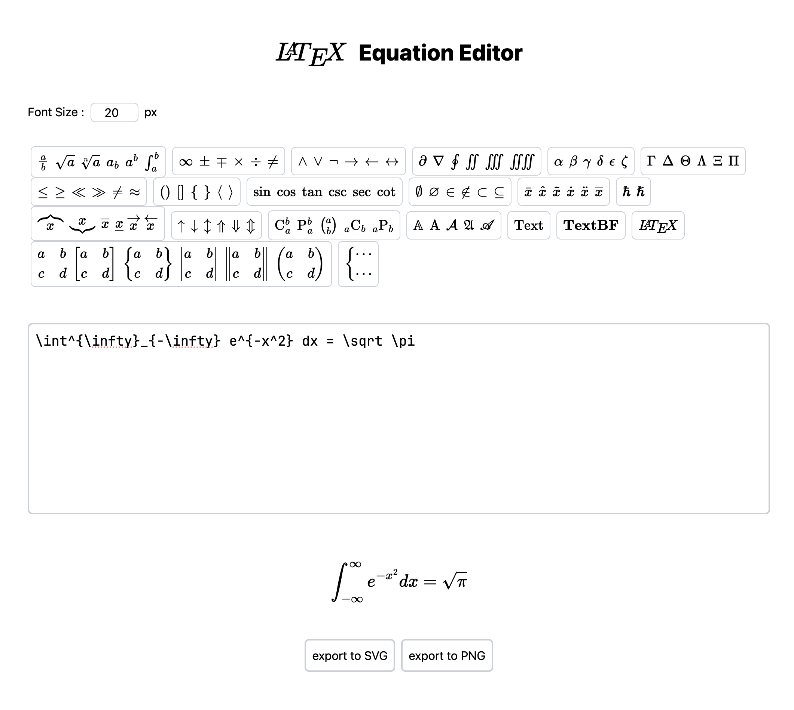

# online-latex-editor

This project is a web application that allows users to write LaTeX equations
and visualize them in real-time. You can export the rendered equations as SVG
or PNG files for use in documents, presentations, and more.

## Features

- Real-time LaTeX Rendering: See your equations as you type using LaTeX.
- Export Options: Save your rendered equations as SVG or PNG files.

## Getting Started

To use the application, simply visit the website, input your LaTeX code,
and export the equation once you're satisfied with the rendering.

## Spces

- Vite
- React
- Tailwind css
- Typescript
